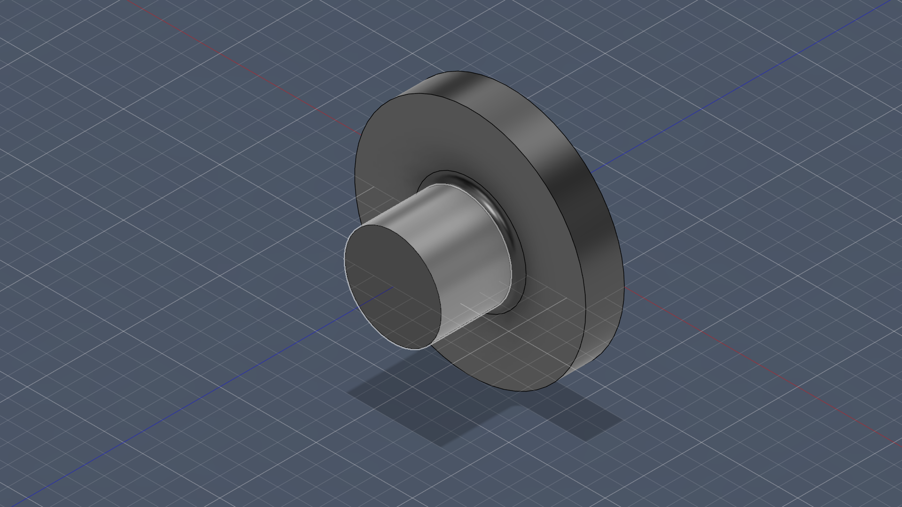
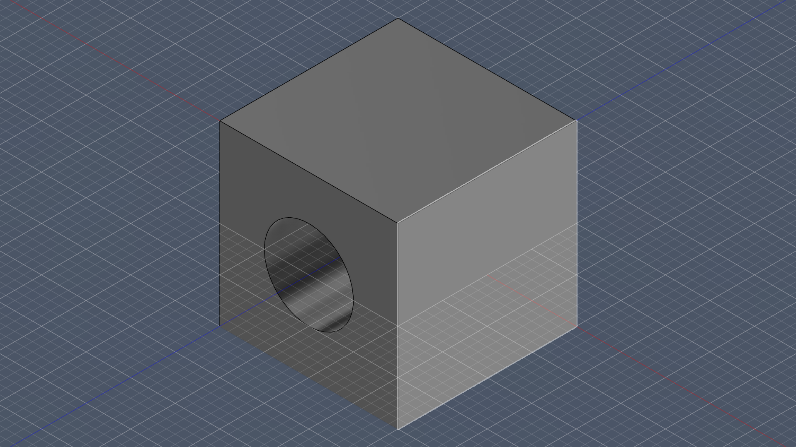
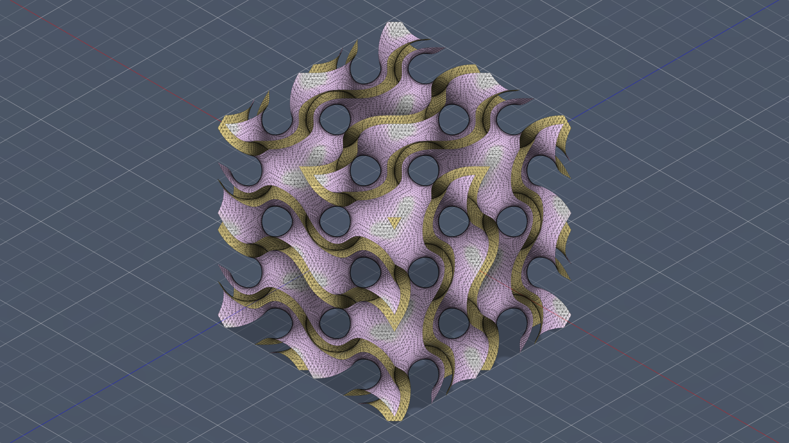
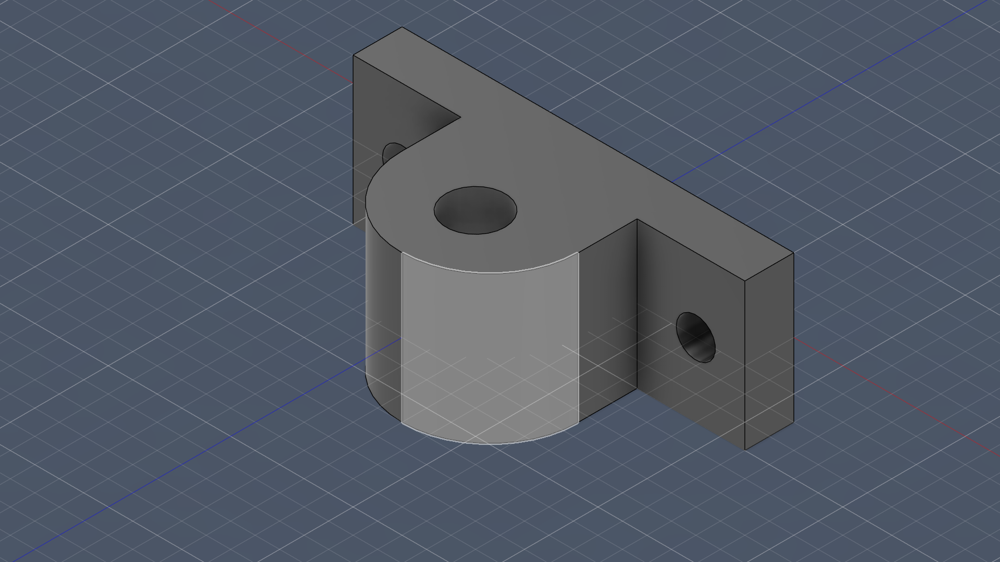
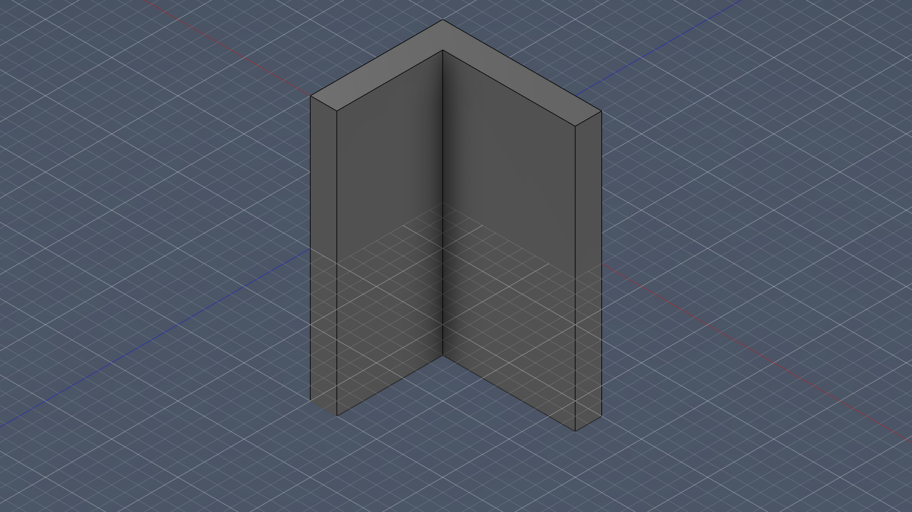
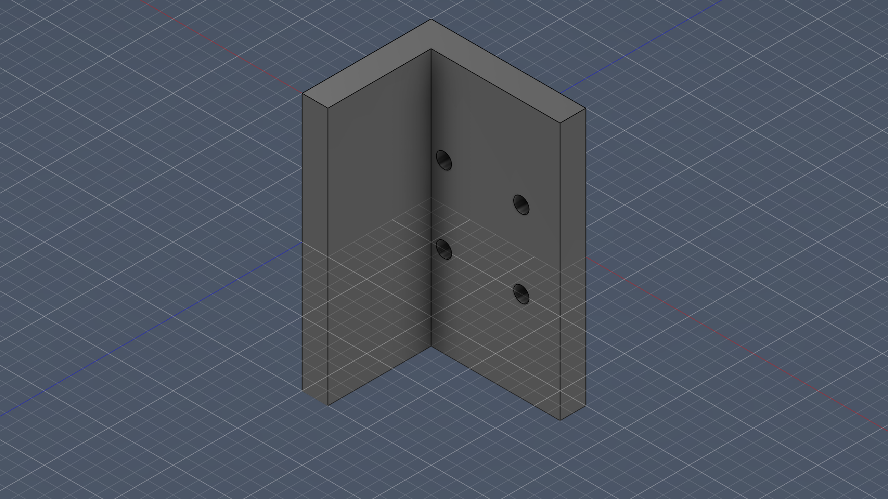

# Automated 3D Modeling Frameworks Documentation

<p align="center">
  
</p>

This repository section contains isolated, automated 3D modeling scripts that allow AI agents and developers to generate parametric 3D models (CAD) or polygon meshes entirely through Python code. This avoids the manual graphical interfaces of traditional software and completely automates the design-to-manufacturing pipeline.

## Overview of Modeling Paradigms

Before diving into the frameworks, it's important to understand the three primary ways 3D models are defined in code:

1. **B-Rep (Boundary Representation) / Parametric CAD**: 
   - *Frameworks:* CadQuery, Build123d, Fusion 360
   - *How it works:* Defines exact geometric boundaries (NURBS curves, precise arcs, flat planes). This is used for engineering, mechanical design, and CNC manufacturing. It exports to `.step` or `.iges` for lossless CAD sharing.
2. **CSG (Constructive Solid Geometry)**:
   - *Frameworks:* OpenSCAD, SolidPython
   - *How it works:* Uses pure mathematics to add and subtract basic primitives (spheres, cubes, cylinders). It is very fast and robust but lacks complex fillets or lofting operations.
3. **Polygon Meshes**:
   - *Frameworks:* Blender, Trimesh
   - *How it works:* Represents objects as thousands of tiny triangles. This is used for video games, organic character modeling, and 3D printing (`.stl`), but it is "lossy" and difficult to mathematically edit once generated.

---

## 1. Build123d (Recommended for CAD)

**Paradigm**: Parametric B-Rep (OpenCASCADE Kernel)
**Directory**: `02_Build123d/`

`Build123d` is the modern, ergonomic successor to CadQuery. It utilizes Python Context Managers (`with` blocks) to implicitly handle the active workplane and part hierarchy. It is the absolute best choice for AI-generated mechanical parts.


### Example
```python
from build123d import *

# Create a box with a hole cut through the top face
with BuildPart() as p:
    Box(20, 20, 20)
    with BuildSketch(p.faces().sort_by(Axis.Z)[-1]):
        Circle(radius=5)
    extrude(amount=-20, mode=Mode.SUBTRACT)

# Export to standard CAD format or Mesh
export_step(p.part, "part.step")
export_stl(p.part, "part.stl")
```

---

## 2. CadQuery

**Paradigm**: Parametric B-Rep (OpenCASCADE Kernel)
**Directory**: `01_CadQuery/`

`CadQuery` is the predecessor to Build123d. It uses a "fluent" API where method calls are chained together. It is incredibly powerful but can sometimes be difficult to debug because the state is hidden inside the chain.



### Example
```python
import cadquery as cq

# The entire operation is chained together
result = cq.Workplane("XY").box(20, 20, 20).faces(">Z").workplane().hole(10)

cq.exporters.export(result, "part.stl")
```

---

## 3. SolidPython (OpenSCAD)

**Paradigm**: Constructive Solid Geometry (CSG)
**Directory**: `03_SolidPython/`

`SolidPython2` is a Python wrapper for OpenSCAD. Instead of learning the domain-specific OpenSCAD language, you write Python, and it compiles it into an OpenSCAD `.scad` script.

### Example
```python
from solid2 import *

cube_shape = cube([20, 20, 20], center=True)
hole_shape = cylinder(r=5, h=30, center=True)

# Math-based subtraction
result = cube_shape - hole_shape
result.save_as_scad("part.scad")
```

---

## 4. Blender (bpy)

**Paradigm**: Polygon Meshes & Rendering
**Directory**: `04_Blender_bpy/`

Blender is the industry standard for organic modeling, VFX, and rendering. The `bpy` library allows you to automate everything inside Blender. *Note: Running this requires the actual Blender application.*

### Example
```python
import bpy

# Add a primitive mesh to the scene
bpy.ops.mesh.primitive_cube_add(size=20, location=(0, 0, 0))
cube = bpy.context.active_object

# Export scene to STL
bpy.ops.export_mesh.stl(filepath="blender_cube.stl")
```

---

## 5. Trimesh

**Paradigm**: Polygon Mesh Analysis
**Directory**: `05_Trimesh/`

`Trimesh` is a pure Python library used for slicing, analyzing, and viewing `.stl` and `.obj` files. It is not traditionally used to *create* CAD from scratch, but rather to analyze or modify meshes generated by other tools (e.g., calculating the volume or center of mass of a 3D scan).

### Example
```python
import trimesh

# Load an existing mesh
mesh = trimesh.load('part.stl')

# Calculate properties
print(f"Volume: {mesh.volume}")
print(f"Center of Mass: {mesh.center_mass}")
```

---

## 6. Signed Distance Fields (SDF)

**Paradigm**: Volumetric Mathematical Surfaces
**Directory**: `07_Signed_Distance_Fields/`

Generates complex engineering metamaterials (like the Gyroid lattice structure) purely from distance-evaluating mathematical equations converted to meshes via Marching Cubes. Perfect for lightweight structural parts.



---

## 7. Engineering Models

**Paradigm**: Applied Parametric B-Rep (`Build123d`)
**Directory**: `06_Engineering_Models/`

Contains fully functional, parametric engineering designs generated programmatically and rendered automatically via the Fusion 360 MCP server.

### Pillow Block Bearing


### Flange Shaft Coupling


---

## 8. Universal File Conversion

**Paradigm**: Cross-format interoperability
**Directory**: `08_File_Conversion/`

A robust Python script that automatically detects and converts 3D file formats. It safely handles Mesh-to-Mesh conversions (STL -> OBJ) using `trimesh` and CAD-to-Mesh conversions (STEP -> STL) using the OpenCASCADE kernel via `build123d`.

It explicitly handles and guards against impossible conversions, such as Reverse Engineering Mesh-to-CAD (STL -> STEP).

### Example
```bash
uv run --with trimesh --with build123d --python 3.12 08_File_Conversion/universal_converter.py input.step output.obj
```

---

## 9. Prompt-Based CAD Modification

**Paradigm**: AI-Driven Autonomous CAD Editing
**Directory**: `09_Import_and_Modify/`

Demonstrates the workflow for autonomously importing downloaded 3D files and computationally modifying them using natural language prompts.

It uses `build123d` to load a `.step` file, filter geometric faces computationally (e.g. "Select the top base face"), and perform boolean operations (e.g. "Drill a 2x2 grid of mounting holes").


*Original Imported Model*


*Autonomously Modified Model*

---

## 10. Fusion 360 MCP (Model Context Protocol)

**Paradigm**: Parametric B-Rep via Agentic RPC
**Directory**: `../ai-autodesk-fusion-mcp/` (External Repository)
**Source**: [https://github.com/itsPremkumar/ai-autodesk-fusion-mcp](https://github.com/itsPremkumar/ai-autodesk-fusion-mcp)

The **Model Context Protocol (MCP)** is an open standard introduced by Anthropic that provides a universal way for AI assistants to connect to external applications. Autodesk Fusion 360 can run a local MCP server that exposes its native CAD tools over HTTP.

This is the ultimate automated 3D modeling tool for local workflows, because it allows an AI agent to execute native Python scripts directly inside the Fusion 360 environment in real-time, instantly spawning components, sketches, and kinematic joints on your screen.

### Example Capabilities
- Execute Python scripts directly inside Fusion 360
- Read design data (bodies, faces, edges, volumes)
- Open, save, and close documents seamlessly

### Execution Example
Instead of running a python script locally, an AI agent sends a payload to the MCP endpoint `http://127.0.0.1:27182/mcp`:

```json
{
  "jsonrpc": "2.0",
  "method": "execute_Python_Runner",
  "params": {
    "code": "import adsk.core; app = adsk.core.Application.get(); app.userInterface.messageBox('Hello from MCP!')"
  }
}
```

---
## Execution Guide

To avoid corrupting your system Python environment when installing heavy CAD kernels like OpenCASCADE, we use `uv` (a fast Python manager) to run these scripts in temporary, isolated environments:

```bash
# Run a CadQuery script
uv run --python 3.12 --with cadquery script.py

# Run a Build123d script
uv run --python 3.12 --with build123d script.py
```
